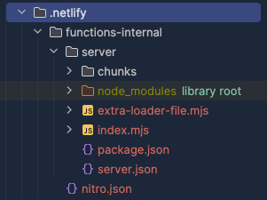
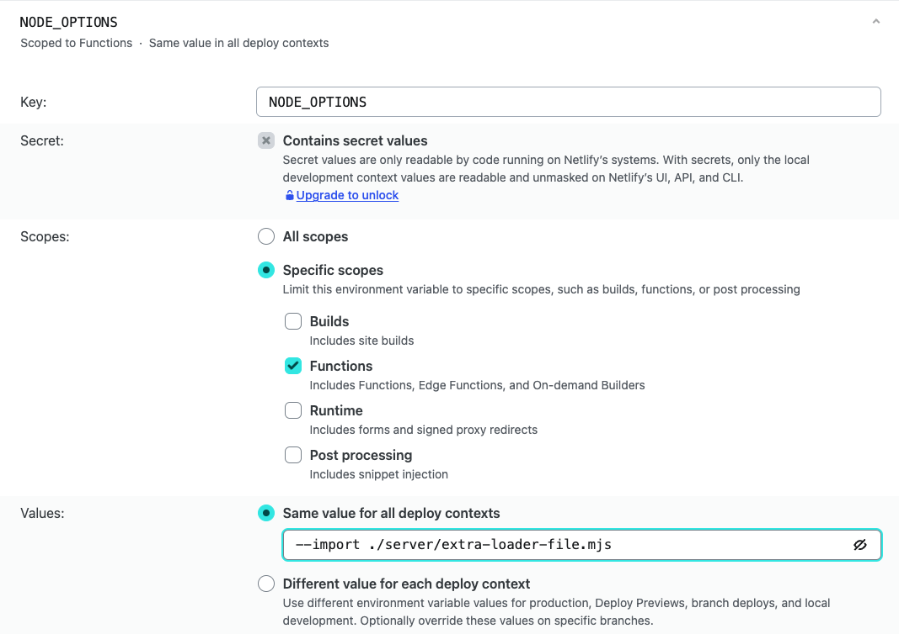

# Nitro with import-in-the-middle

This is a small example of using [import-in-the-middle](https://github.com/nodejs/import-in-the-middle) with Nitro and Netlify. 

Like described in the `import-in-the-middle` (iitm) docs, the file which registers the iitm hook needs to be added with the node `--import` flag.

## The extra file

The file which registers the hook is called `extra-loader-file.ts` and located at the root of the project. The rollup options are changed to include the `extra-loader-file.ts` in the build folder.

The `.netlify` folder will look like this when installing with `npm install` and after building with `build:netlify`:

## Setting the `--import` flag

In Netlify, an environment variable is added for the "Function" scope:

## The Problem

I tried different file paths in the `--import` flag, but the `extra-loader-file.mjs` cannot be found. I am not sure if this file is even included.

In case this file is included, the question is whether the `import-in-the-middle` hook can be registered correctly (the `node_modules` must include this package).
